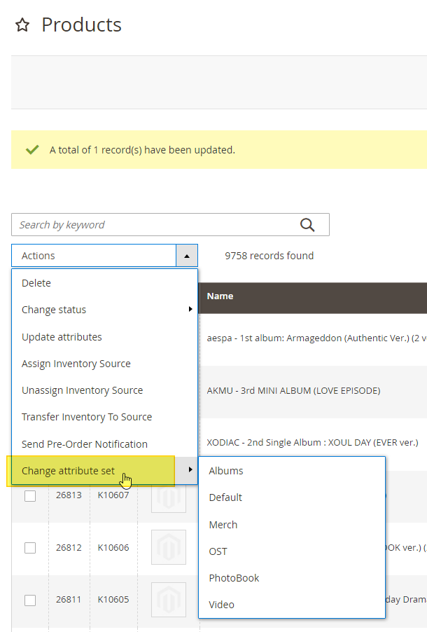

# Magento2 Change Attribute-Set on Product Grid
- Change the attribute sets on your Magento e-com website easily to make it function according to your requirements.
- Plus, you don’t need any type of technical knowledge to use the Change attribute set extension for Magento 2.

### Key Features of Change Attribute Set:
- Organize your e-com website by changing attribute sets when required.
- Ensure error-free changes in attribute sets on your Magento website.
- Perform the complex task of changing attribute sets easily.
- Benefit from a feature-rich and detailed backend admin panel.
- Get customized features and functionality to suit your requirements.

### Problem:
By default, Magento 2 allows users to make changes to the attribute set (such as Bag, Bottom, Default, Downloadable, Gear, etc.) of a product. However, for store owners to make these changes, they need to do so manually and individually for each product. This process can be time-consuming and require a lot of effort on the part of the store owner.

### Solutions:
Magento 2 Change attribute set by MageAnts allows merchants to modify or alter the attribute set of products within the Magento 2 website. With this extension, admin can easily adjust the attributes set of their products, making it easier to manage and organize their catalog. This extension offers a more flexible and user-friendly way to update and change attribute sets, which can help improve the overall efficiency and productivity of a Magento 2 store.

### Installation:
```
composer require hgati/change-attribute-set:dev-master
```

### How to use:


